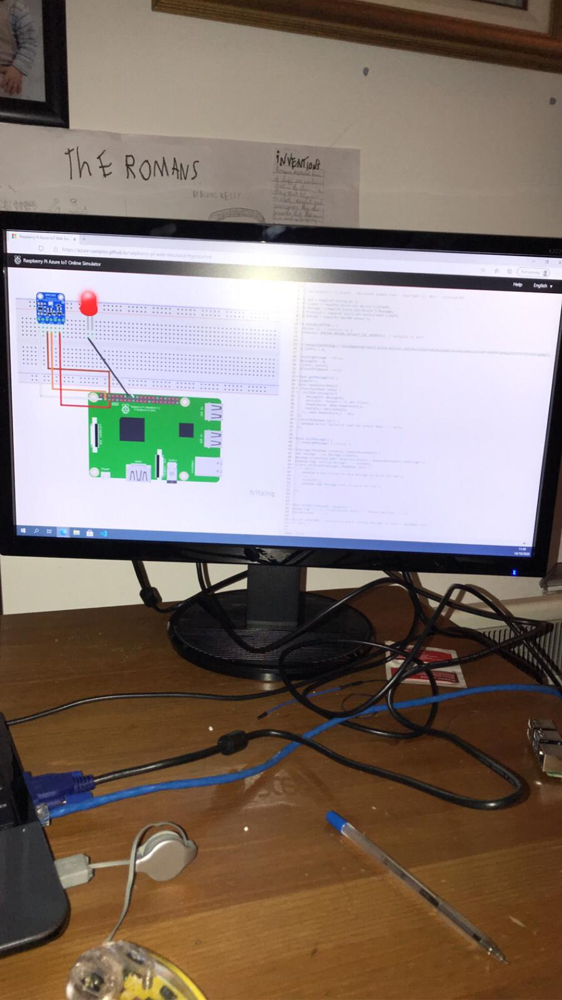
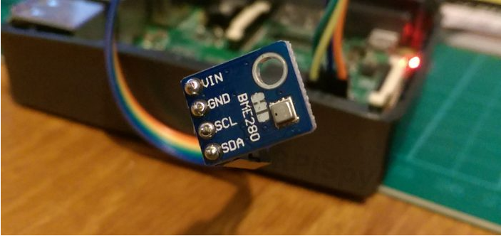

# LED Project

Started the raspberry pi LED project. Firstly, we unboxed the raspberry pi and screwed the fan into the case to stop it from overheating. We then fitted the raspberry pi into the case and connected it to a monitor, keyboard and mouse. After this we made sure the Raspbian software was downloaded on the raspberry pi. It was already installed so we proceeded to update the software and try commands in the terminal.

Next day: Today we used many of the hardware components in the starter kit that came with the computer. We used an LED, a breadboard, a 220H resistor and two wire connections. We used these to create the circuit that allows the LED to light up. After finishing the circuit, we had to do a lot of research and run many commands to figure out how to download idle from python3. After a lot of research and failed attempts we managed to download idlex instead which worked fine. We then typed our code into idlex and ran it in the command terminal. Firstly, it worked but soon after it would no longer flash and we had to redo the circuit. This worked fine and we made the LED flash three times in a row and then turn sleep. AFter this we tweaked the code to make the duration of the flashes different.

Today we accessed Microsoft Azure.
We created an Iot hub.
Used a raspberry pi simulator.
Added device to Iot hub.
Managed simulator from Iot hub by turning LED on and off.
Created a new Iot hub for the physical device.
Added real raspberry pi device.
Installed Putty on laptop.
Remotely connected over the internet to raspberry pi device using Putty and SSH.
Had to obtain the IP address using shell command `ifconfig`.
IP address was 192.168.0.207.
We downloaded and installed Visual Studio Code to allow us to authenticate to Github to clone the repo [https://github.com/Azure-Samples/azure-iot-samples-node.git](https://github.com/Azure-Samples/azure-iot-samples-node.git).
We then installed the sample packages from the repo using the command `npm install`.

Today we configered our sample application to use simulated data as we do notnhave a sensor yet.
we edited the config.json.
We tried to run the application but immediately got errors about not being able to access a cjs package.
We spent the remainder of the day trouble shooting:
We uninstalled `nodejs`, and reinstalled version 12.x.
We reinstalled the azure iot sample packages in the global context and the local usr context using the commands `npm install` inside the folder. We used `npm install -g` for the global context.

We tracked down and installed a missing `cjs` package using `npm install cjs -g` to install it globally. We also installed it locally but to no avail.

Frustrating day but we learned about how packages are installed.

We used more commands such as `npm list` `npm root` `npm prefix` `npm bin` `npm get prefix` `npm list -g --depth 0` 

Today we worked remotely from home and did voice and video calls over Microsoft Teams. We shared screens to help us troubleshoot issues. I completed module 1 of the pluralsight hardware fundamentals course. We tried to connect remotely to the raspberry pi device. We looked at options around proxies and firewalls and port forwarding but they proved a bit too complicated. We came upon a solution upon VNC. It is pre installed on the raspberry pi. We enabled VNC server.

We signed up for a VNC account and we installed VNC viewer on our local machine and signed in with our account details. We could then connect to the raspberry pi device over the internet from VNC viewer as in the screenshot below.

Today I started on a new module in the pluralsight Computer Hardware Course. The module was cables and connectors and talked about topics such as internet cables and the power and pins of different connectors. It also showed pictures of the wires inside of different cables and explained how the names of the cables are connected to the appearance of the wires.

We then went through the steps on the microsoft docs site. We used VNC and VSC to to this. When it came to running the sample application we came across the same error again which involved terms such as 'throw e' and 'no such file or directory'. There is a picture of the error further up the page. The error also mentioned files such as 'cjs' and 'internal/modules'.

Firstly today, I continued working on the computer hardware fundamentals course. I followed modules about internal Hardware Components such as Mobos and CPUs and then another topic being PC Storage.

We then continued working with the RaspberryPi and because of issues with Python we decided to try a different language called C. It has dependancies on a number of Github repos. One of which is discontinued. We sourced an alternative repo for the one that has been discontinued. The four repos we use are:

- [https://github.com/Azure-Samples/iot-hub-c-raspberrypi-client-app.git](https://github.com/Azure-Samples/iot-hub-c-raspberrypi-client-app.git)
- [http://github.com/azure/azure-iot-sdk-c.git](http://github.com/azure/azure-iot-sdk-c.git)
- [https://github.com/WiringPi/WiringPi.git](https://github.com/WiringPi/WiringPi.git)
- [https://github.com/kgabis/parson.git](https://github.com/kgabis/parson.git)

We edited the `setup.sh` file to clone the replacement repo. That worked fine. But the folder structure seems to be slighty different to the original. We are getting a build error which we tried to trouble shoot. But with no success today. We need to step through the build script line by line to ensure that it can find the commands it is calling at run time.

This is the error we ended with today.

Firstly, I finished the pluralsight compuer hardware course. The modules uncluded some infromation about PC Storage and printers along with multifunctional devices.

Next, we installed the azure IOT extensions on VSC.

[azure iot tools](https://marketplace.visualstudio.com/items?itemName=vsciot-vscode.azure-iot-tools)

We then re-ran the previously attempted python steps. We still got the same error. We switched our attention to [Quickstart: Send telemetry from a device to an IoT hub and monitor it with the Azure CLI](https://docs.microsoft.com/en-us/azure/iot-hub/quickstart-send-telemetry-cli)

We used the azure cloud shell, created a simulated device, registered the device with our previously created azure iot hub and then we were able to connect the simulated device to azure iot and send data to azure. In a separate cloud shell we monitored the device and send messages from azure to the device and back. We were able to visualize data sent to and from the device in the azure portal. 

We were finally able to connect and manage a device with azure iot. We then looked at next steps we plan on using next week. After this I completed the first module of an azure fundamentals course.

[Exam AZ-900: Microsoft Azure Fundamentals](https://docs.microsoft.com/en-us/learn/certifications/exams/az-900)

Today, I started off by making a circuit for the bme280 sensor which used four female-female wires. I followed steps on raspberrypi.com to enable i2c which was needed to connect the sensor to the raspberry pi.

I used commands such as  "wget https://bitbucket.org/MattHawkinsUK/rpispy-misc/raw/master/python/bme280.py" and "python bme280.py" to download and run the required script. Following this we faced an error that was the raspberry pi not being able to pick up the sensor. This meant that the sensor needed to be soldered to the pins for the breadboard.

I then used a soldering iron to solder the two components together but following this we faced the same error yet again.

We then decided to attempt to connect a different type of sensor to the raspberry pi. It was called a DHT11. It required no soldering but a much more complicated circuit. I followed steps to connect this sensor to the raspberry pi but yet again there was no luck and the circuit would not work. We decided to leave it the way it was and avoid more trouble shooting.

Below is an image of the DHT11 sensor.

